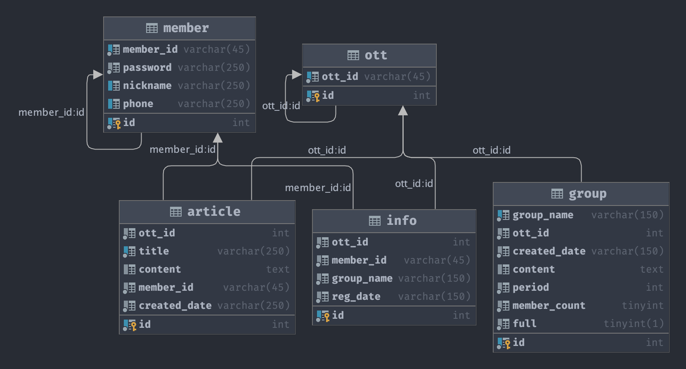

# OTT-share-service
팀프로젝트 - OTT 공유 플랫폼 서비스입니다.

- 회원 관리 기능
- 4명까지 가입할 수 있는 OTT 그룹 관리 기능
- 꿀잼 추천 게시판을 통해 이달의 추천작 및 추천글 관리 기능 

# 팀원 및 역할
- 왕대륜
  - 팀장 - 데이터베이스 관리
- 김건우
  - jsp, html, css
- 양진철
  - jsp, html, css
- 유동엽
  - 회원 관리 기능 구현
- 서한성
  - 그룹, 꿀잼 추천 게시판 관리 기능 구현

# 기술 스택
- maven archetype
- Java
- JSP
- JSTL
- JavaScript
- HttpServlet
- MySQL
- AWS RDS
- Lombok

# 데이터베이스 설계

# 주요 기능

- 회원 관리
  - 회원가입 기능
    - 아이디, 닉네임 중복검사
    - 중복검사 후 회원가입 가능
  - 로그인 기능
    - 아이디, 비밀번호 확인을 위한 DB 접근
    - 비밀번호 틀렸을 시 메시지 기능
- 그룹 모집 및 관리
  - 그룹 모집, 참여, 삭제, 수정, 조회
  - 권한설정
    - 이미 참여한 그룹일 경우 참여 불가
    - 그룹 참여자만 수정 및 삭제 가능
    - 로그인 상태에서만 그룹 모집 가능
- 꿀잼 추천 게시판 기능
  - 게시판 작성, 조회, 수정, 삭제
  - 권한설정
    - 작성자만 수정, 삭제 가능
    - 로그인 상태에서만 게시글 작성 가능
  
